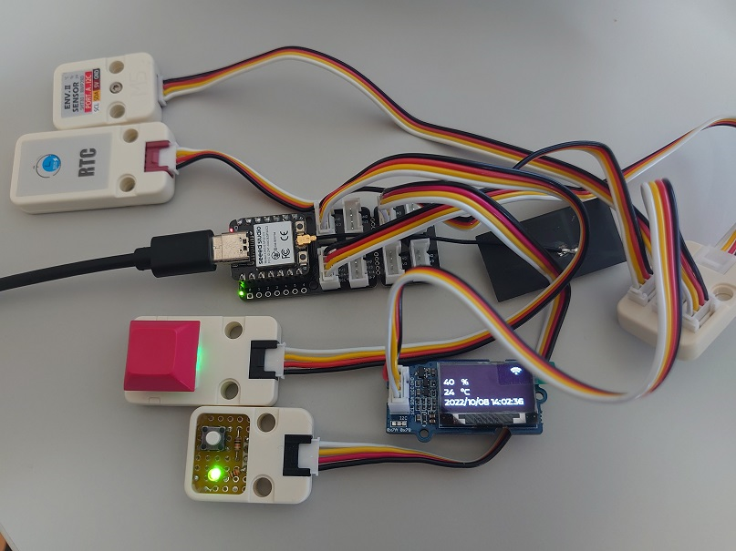
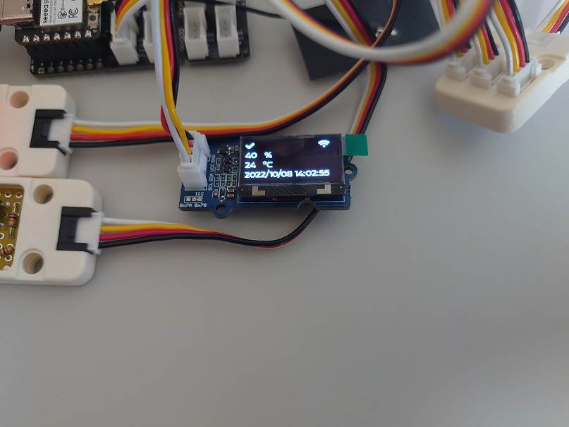
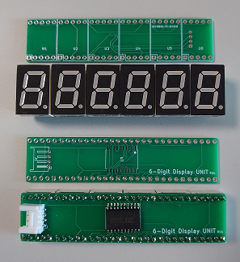
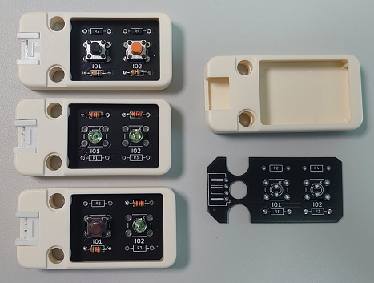

# XIAO_ESP32C3_IDF_Sample

### XIAO ESP32C3をいろいろと試してみる。

### 使用機材
- [Seeed Studio XIAO ESP32C3](https://www.switch-science.com/collections/seeed/products/8348)
- [Seeed Studio XIAO Groveシールド](https://www.switch-science.com/collections/seeed/products/6687)
- [M5Stack用拡張ハブユニット](https://www.switch-science.com/collections/m5stack/products/5696)
- [M5Stack用HYM8563搭載 リアルタイムクロック（RTC）ユニット](https://www.switch-science.com/collections/m5stack/products/7482)
- M5Stack用温湿度気圧センサユニットVer.2
- [Grove - 0.96インチ OLEDディスプレイ（SSD1315）](https://www.switch-science.com/collections/seeed/products/7002)
- [M5Stack用メカニカルキーボタンユニット](M5Stack用メカニカルキーボタンユニット)
- [M5Stack用ミニプロトユニット](https://www.switch-science.com/collections/m5stack/products/6557)を使ったお手製ボタンとLEDユニット
- [M5Stackプロトユニット用プラスチックケース（4個入）](https://www.switch-science.com/collections/m5stack/products/8451)と[JLCPCB](https://jlcpcb.com/)で製造したPCBを使ったお手製ボタンとLEDユニット

### 環境
- "Seeed Studio XIAO Groveシールド"のI2Cポートに"M5Stack用拡張ハブユニット"を接続。
- "M5Stack用拡張ハブユニット"に"M5Stack用HYM8563搭載 リアルタイムクロック（RTC）ユニット"、"M5Stack用温湿度気圧センサユニットVer.2"、"Grove - 0.96インチ OLEDディスプレイ（SSD1315）"を接続。
- "Seeed Studio XIAO Groveシールド"の"0,1"ポートに"M5Stack用メカニカルキーボタンユニット"を接続。
- "Seeed Studio XIAO Groveシールド"の"2,3"ポートに"お手製ボタンとLEDユニット"を接続。

### 動作

- WiFiに接続する。
- NTPサーバーと時刻同期し、RTCへ設定する。
- 環境センサーで、温度と湿度を測定する。
- RGBなLEDは、色を変化させながら点滅する。
- LEDは、点滅する。
- ディスプレイは、WiFi表示、日付/時間表示、湿度・温度表示、ボタンクリック時のOK表示をする。

### 2022.11.03追記

- PCBをJLCPCBにて製造。
- 秋月にてOSL10564-Iシリーズではんだ付け。
- 6桁のDigitDisplayが完成。

### 2022.12.03追記

- PCBをJLCPCBにて製造。
- 秋月にてタクトスイッチと3mmLEDではんだ付け。
- Button×2、LED×2、Button×1&LED×1が完成。